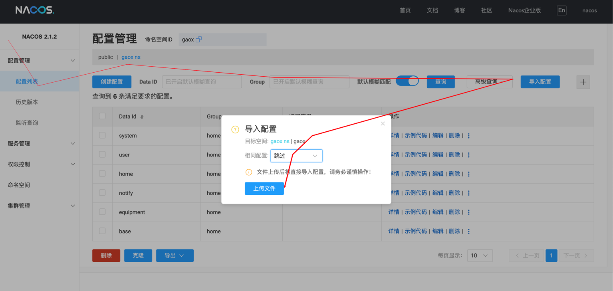
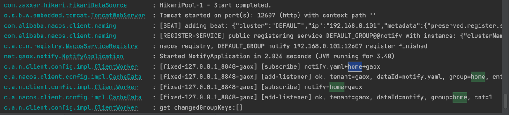

# nacos配置中心的操作

## 1. 安装

## 2. 创建命名空间和分组

本例创建命名空间`gaox`分组`home`。

## 3. 打开配置管理

选中`gaox`命名空间，点击`新建配置`，填写`home`分组，然后选择格式为`yaml`，将[home](home)
的文本放入配置内容中，然后点击`保存`。
也可以将[home](home)压缩成`zip`格式，然后点击`上传`
，检查一下命名空间和分组是否正确，然后点击`上传文件`，如图：


## 启动效果

```yaml

spring:
  application:
    name: notify
  cloud:
    nacos:
      config:
        server-addr: 127.0.0.1:8848
        namespace: gaox
        group: home
        enable-remote-sync-config: true
        file-extension: yaml
        cluster-name: gaoxizhi
```

按照此配置，启动项目，可以看到已经订阅了匹配的配置文件。
