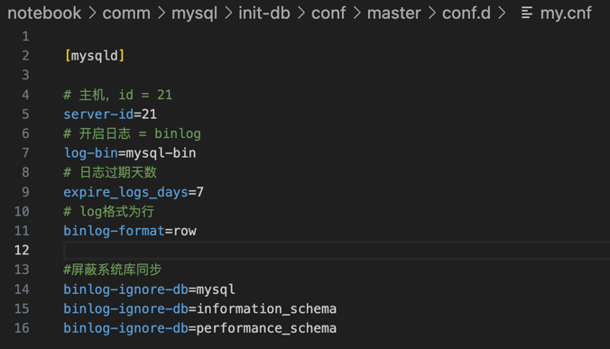

# canal 从binlog解析对象，同步到redis和es

## 配置mysql开启binlog



```ini
[mysqld]

# 主机，id = 21
server-id=21
# 开启日志 = binlog
log-bin=mysql-bin
# 日志过期天数
expire_logs_days=7
# log格式为行
binlog-format=row

#屏蔽系统库同步
binlog-ignore-db=mysql
binlog-ignore-db=information_schema
binlog-ignore-db=performance_schema
```

在mysql安装目录中，找到my.ini文件，新建文件夹